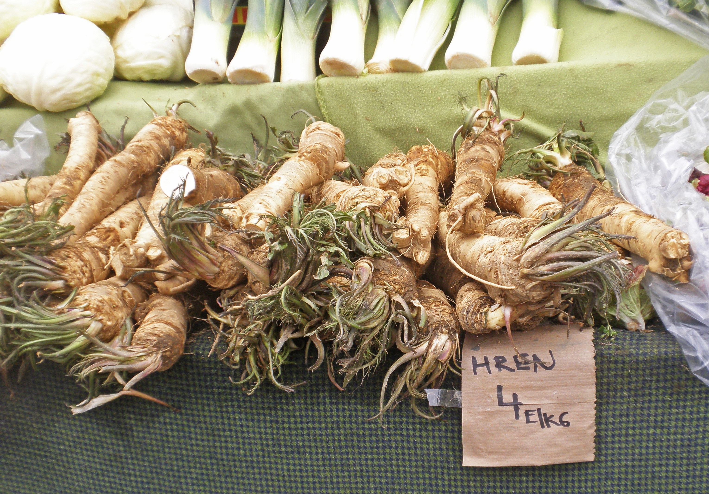

# Updated Headline Generation: Creating Updated Summaries for Evolving News Stories

**Dataset for our ACL-2022 paper "Updated Headline Generation: Creating Updated Summaries for Evolving News Stories"**

**Data can be found here:** [https://zenodo.org/record/6578378](https://zenodo.org/record/6578378)

We release ids and metadata for selected examples from the [NewsEdits](https://arxiv.org/abs/2104.09647) corpus for the task of *updated headline generation*. The train/valid/test splits of the <b>H</b>eadline <b>R</b>evision for <b>E</b>volving <b>N</b>ews (**HREN**) dataset are available under `hren`. Each example is represented as a JSON object with the following structure:

```
{
  id: str,
  meta_info: {
    has_headline_change: bool,
    has_nontrivial_headline_change: bool,
    has_body_change: bool,
    has_nontrivial_body_change: bool
  },
  old_headline_version_url: str,
  new_headline_version_url: str,
  old_body_version_url: str,
  new_body_version_url: str
}
```

Note that the `id` field is formatted as:

```
[DB SOURCE]_[ARTICLE ID]:[OLD HEADLINE VERSION INDEX]-[NEW HEADLINE VERSION INDEX]-[OLD BODY VERSION INDEX]-[NEW BODY VERSION INDEX]:[PAIR INDEX]
```

To obtain the full headline and body texts, you will need to map the ids back to the NewsEdits corpus using the following components: `DB SOURCE`, `ARTICLE ID`, `OLD HEADLINE VERSION INDEX`, `NEW HEADLINE VERSION INDEX`, `OLD BODY VERSION INDEX`, and `NEW BODY VERSION INDEX`.

The authors of NewsEdits have released their corpus [here](https://github.com/isi-nlp/newsedits). We have provided the `map_to_newsedits.py` script to help map the HREN ids back to the original NewsEdits corpus.

We also include IDs and metadata for examples we used for training and evaluating a classifier to filter HREN, as well as in the unfiltered updated headline generation data. These can be found in the `supplementary_data` folder.

Additionally, we include annotations from human evaluation under `annotations`. Each example is structured as follows:

```
{
  example_id: str,
  annotator_id: int,
  prediction: str,
  predicted_by_model: str,
  factual: int,
  important_changes: int,
  retains_information: int,
  grammatical: int,
  concise: int
}
```


If you find this work useful, please cite our paper:

```
@inproceedings{PanthaplackelETAL22UpdatedHeadlineGeneration,
  author = {Panthaplackel, Sheena and Benton, Adrian and Dredze, Mark},
  title = {Updated Headline Generation: Creating Updated Summaries for Evolving News Stories},
  booktitle = {Association for Computational Linguistics},
  pages = {6438--6461},
  year = {2022},
}
```

__Enjoy!__


Image from [Wikimedia Commons](https://commons.wikimedia.org/wiki/File:Hren_(Horseradish)_(25443687854).jpg) licensed under ([CC BY-SA 2.0](https://creativecommons.org/licenses/by-sa/2.0/deed.en))
